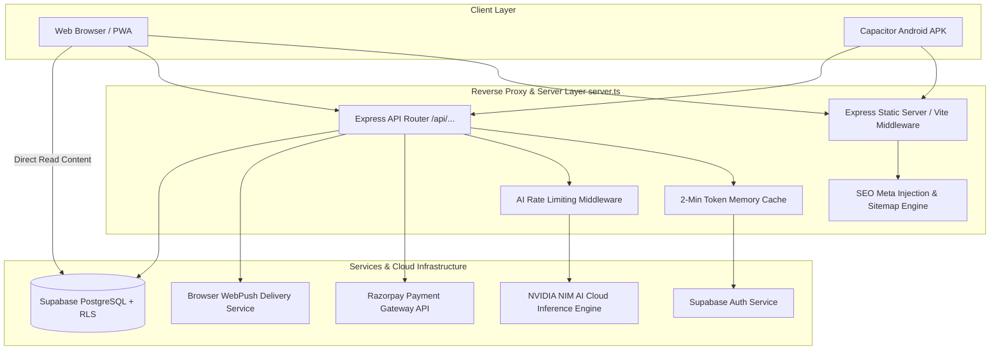
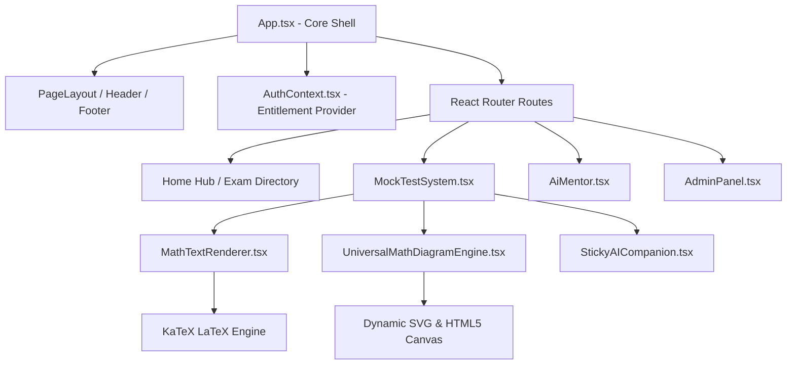

# Architecture

This document provides a comprehensive technical architecture description of **OdishaExamPrep** (`https://www.odishaexamprep.in`), reflecting its current codebase implementation.

---

## Stack

| Layer | Technology | Version | Purpose | Reason for Choosing | Alternatives Considered |
| :--- | :--- | :--- | :--- | :--- | :--- |
| **Frontend Framework** | React | `^19.0.0` | Core UI View Library & Component Tree | High performance, huge ecosystem, reactive DOM updates for complex test-taking state. | Vue.js, Angular, Svelte |
| **Routing** | React Router | `^7.14.0` | Client-Side SPA Navigation & Route Protection | Native React 19 support, flexible route matching, seamless data loading hooks. | TanStack Router, Page.js |
| **CSS Framework** | Tailwind CSS | `@tailwindcss/vite ^4.1.14` | Utility-first CSS Design System | Zero-runtime CSS compilation, fast development, consistent design tokens (`brand-600`). | Styled Components, Bootstrap |
| **Animation Engine** | Framer Motion | `^12.38.0` | Declarative Micro-Animations & Page Transitions | High performance spring animations, seamless layout transitions (`motion.div`). | GSAP, Anime.js |
| **Math Renderer** | KaTeX | `^0.17.0` | High-Speed Mathematical Notation Rendering | Fast client-side rendering of complex LaTeX formulas without external network latency. | MathJax |
| **Data Visualization** | Recharts | `^3.8.1` | React Analytics Charts & Performance Graphs | Native React SVG charts, responsive container support for subject score radars and trends. | Chart.js, D3.js |
| **Sanitization** | DOMPurify | `^3.4.1` | XSS Attack Prevention in Dynamic HTML | Best-in-class HTML sanitization for user-generated explanations and math markup. | sanitize-html |
| **Mobile Shell** | Capacitor | `^8.4.1` | Cross-Platform Native Mobile Container | Direct web-to-mobile bridge, allows building native Android APK from the React web codebase. | React Native, Flutter |
| **Backend Framework** | Express.js | `^4.21.2` | Server API Routes, Payment Gateways & SEO SSR | Lightweight Node.js server framework, high throughput, simple middleware integration. | Fastify, NestJS |
| **Backend Runtime** | Node.js + `tsx` | `Node.js v22+` / `tsx ^4.21.0` | Server TypeScript Execution Runtime | Zero-build instant TypeScript server execution during development and ESBuild bundler in prod. | ts-node, Bun |
| **Database & Auth** | Supabase | `@supabase/supabase-js ^2.103.0` | Managed PostgreSQL, Row Level Security & Auth | Open-source Firebase alternative with real SQL relational tables, strong RLS, and admin API. | Firebase, AWS Amplify |
| **AI Engine** | NVIDIA NIM Cloud | Llama 3.1 8B Instruct | AI Mentor & Real-Time Doubt Resolution | Ultra-fast inference latency, cost-effective API pricing, high reasoning capability for math. | OpenAI GPT-4o, Anthropic Claude |
| **Payment Gateway** | Razorpay | Orders API v1 | Digital Payments (UPI, Cards, NetBanking) | Industry standard for Indian payment processing, instant UPI QR payment flow. | Stripe, Cashfree |
| **Push Engine** | WebPush | `web-push ^3.6.7` | Standard Web Push Notification Dispatcher | VAPID key based push notification delivery directly to browser Service Worker (`sw.js`). | Firebase Cloud Messaging (FCM) |

---

## High Level Architecture



### System Communication Summary
1. **Frontend to Server (`server.ts`):** HTTPS REST requests for secure transactions (Razorpay order creation, signature verification, push subscription management, and AI completions).
2. **Frontend to Database:** Direct HTTPS calls via Supabase Client SDK (`supabase.ts`) protected by PostgreSQL Row Level Security (RLS) policies.
3. **Server to External Cloud APIs:**
   - `server.ts` communicates with **Razorpay API** (`https://api.razorpay.com/v1`) using Basic Auth credentials.
   - `server.ts` communicates with **NVIDIA NIM API** (`https://integrate.api.nvidia.com/v1`) using Bearer Token authentication.
   - `server.ts` communicates with **Browser Push Services** via VAPID keys.

---

## Folder Structure

```
OdishaExamPrep Website/
├── .env                       # Local environment variables & private keys
├── .env.example               # Environment template for deployment
├── android/                   # Capacitor Android native project & Gradle build wrapper
├── build/                     # Production output (Vite dist assets + bundled server.js)
├── public/                    # Static public web assets
│   ├── android-chrome-192x192.png # PWA Web App Icon (192x192)
│   ├── favicon.svg            # Primary Brand SVG Logo
│   ├── notification.mp3       # Sound notification audio trigger
│   ├── site.webmanifest       # PWA Application Manifest
│   └── sw.js                  # Service Worker for Web Push Notifications
├── server.ts                  # Backend Express Node.js Server Implementation
├── supabase/                  # Database Schema Migrations & RLS Policy SQL files
│   └── migrations/
│       ├── 20260614000000_create_user_purchases_and_archive.sql
│       ├── 20260615000000_secure_content_tables.sql
│       ├── 20260615010000_enable_attempts_table.sql
│       ├── 20260616094600_diagram_telemetry.sql
│       ├── 20260623094000_create_activities_table.sql
│       └── 20260705000000_push_notifications.sql
└── src/                       # React 19 Frontend Application Source
    ├── AdminPanel.tsx         # Comprehensive Administrative Dashboard
    ├── AnalyticsView.tsx      # Performance & Accuracy Analytics View
    ├── App.tsx                # Main Application Router & Shell Component
    ├── ErrorBoundary.tsx      # Global Error Boundary Fallback Handler
    ├── MockTestSystem.tsx     # Full Test Taking Engine (Timer, Palette, Submit)
    ├── TestResultsView.tsx    # Test Results Breakdown & Rank Analytics
    ├── components/            # Shared & Feature Components
    │   ├── AnimatedRoutes.tsx
    │   ├── Button.tsx
    │   ├── ChangeImpactModal.tsx
    │   ├── DiagramTemplateSelector.tsx
    │   ├── LoadingPortal.tsx
    │   ├── MathTextRenderer.tsx
    │   ├── OnboardingTour.tsx
    │   ├── PageLayout.tsx
    │   ├── ProtectedRoute.tsx
    │   ├── PushPermissionPrompt.tsx
    │   ├── SearchableSelect.tsx
    │   ├── StickyAICompanion.tsx
    │   ├── TimePicker.tsx
    │   └── UniversalMathDiagramEngine.tsx # Dynamic Canvas/SVG Geometry Renderer
    ├── hooks/                 # Custom React State Hooks
    ├── lib/                   # Business Logic, State Contexts & Services
    │   ├── AuthContext.tsx           # Global Auth & Entitlement Provider
    │   ├── activityTracker.ts        # Attempt & Streak Logger
    │   ├── aiDiagnosticManager.ts    # AI Diagnostic Assistant
    │   ├── animations.ts             # Framer Motion Transition Tokens
    │   ├── capacitorShim.ts          # Native Mobile Device Bridge
    │   ├── defaultAchievers.ts       # Platform Topper Testimonials Data
    │   ├── entitlementEngine.ts      # Client Entitlement Resolution Ledger
    │   ├── entitlementManager.ts     # User Entitlement Sync Logic
    │   ├── examService.ts            # Supabase Content Fetcher Service
    │   ├── pushNotifications.ts      # Browser Push Registration Logic
    │   ├── routes-config.ts          # Server Route Match Config
    │   ├── scrollManager.ts          # Page Reset & Scroll Utility
    │   ├── supabase.ts               # Supabase Client Singleton
    │   └── utils.ts                  # Classnames Merger (`clsx` + `tailwind-merge`)
    ├── pages/                 # Standalone React Pages
    │   ├── AdminDashboardPage.tsx
    │   ├── AdminLoginPage.tsx
    │   ├── AiMentor.tsx              # Interactive AI Tutoring View
    │   ├── BlogList.tsx              # Official Prep Blog Portal
    │   ├── BlogPost.tsx              # Article Detail Page with Schema Markup
    │   └── NotFoundPage.tsx          # 404 Fallback View
    ├── index.css              # Design Tokens & Custom Utility Classes
    └── main.tsx               # Application React Mounting Entrypoint
```

---

## Routing Architecture

### Route Matrix

| Route Path | Type | Component / Target | Access Level | Description |
| :--- | :--- | :--- | :--- | :--- |
| `/` | Public | `App.tsx` | All | Home portal showing exam categories and test series. |
| `/exams/:examId` | Public | `App.tsx` | All | Detailed exam syllabus breakdown and series purchase pad. |
| `/test/:testId` | Protected | `MockTestSystem.tsx` | Entitled / Free | Timed mock test simulator. Requires access authorization. |
| `/results/:attemptId` | Protected | `TestResultsView.tsx` | Authenticated | Detailed score card and section analysis for an attempt. |
| `/analytics` | Protected | `AnalyticsView.tsx` | Authenticated | Student historical strength radar and progress graphs. |
| `/ai-mentor` | Public | `AiMentor.tsx` | All | Interactive AI Tutoring Workspace. |
| `/blog` | Public | `BlogList.tsx` | All | Preparation articles and exam news listing. |
| `/blog/:id` | Public | `BlogPost.tsx` | All | Article detail page with JSON-LD schema injection. |
| `/admin-login` | Public | `AdminLoginPage.tsx` | All | Portal for site administrators to log in. |
| `/admin` | Admin | `AdminPanel.tsx` | Admin Role Only | Comprehensive administrative suite. |
| `/privacy-policy` | Public | `PrivacyPolicy.tsx` | All | Privacy policy document. |
| `/terms-of-service` | Public | `TermsOfService.tsx` | All | Terms of service document. |
| `/refund-policy` | Public | `RefundPolicy.tsx` | All | Refund and cancellation guidelines. |

---

## Component Architecture



### Core Components Summary
1. **`UniversalMathDiagramEngine.tsx`**: Renders geometric figures, triangles, circles, coordinate axes, Venn diagrams, and flowcharts based on structured JSON props. Integrates KaTeX to render LaTeX labels directly inside geometric shapes.
2. **`MathTextRenderer.tsx`**: Text parser that extracts inline (`$...$`) and block (`$$...$$`) LaTeX formulas and renders them using KaTeX while sanitizing text with DOMPurify.
3. **`StickyAICompanion.tsx`**: Floating widget that follows students during practice and mock tests, offering contextual hints without revealing direct answers.
4. **`MockTestSystem.tsx`**: Test-taking environment managing timer countdowns, question status palettes (Not Visited, Answered, Marked for Review), and instant score calculation.

---

## State Management

- **Global Auth & Entitlement State (`AuthContext.tsx`):** Maintains the currently authenticated user (`user`), active session token (`session`), admin flag (`isAdmin`), user metadata entitlements (`purchasedSeries`), and database-driven entitlement list.
- **Local Component State:** Uses standard React `useState` and `useReducer` for test progress, current question index, user answers, and timer countdown.
- **Entitlement Ledger Caching (`entitlementEngine.ts`):** Combines entitlements cached in Supabase Auth user metadata (`user_metadata.purchasedSeries`) with real-time verification against `public.user_purchases` database table.

---

## Business Logic Architecture

### Entitlement & Access Control Logic
Access to premium mock tests and question banks is resolved using a hierarchical precedence model in `entitlementEngine.ts`:

```
Access Granted IF:
  1. User has 'full_access' pass in user_purchases
  OR 2. User has explicit purchase record for 'exam_bundle_<examId>'
  OR 3. User has explicit purchase record for parent test series ID
  OR 4. User has explicit purchase record for specific mock test ID
  OR 5. Content is flagged as Free (isPremium === false)
  OR 6. User email is in hardcoded Admin list
```

---

## API Architecture

### Core Endpoints

#### 1. Razorpay Order Creation
- **Endpoint:** `POST /api/payment/order`
- **Auth:** Public
- **Purpose:** Server-side creation of Razorpay Order ID using verified database price to prevent client-side pricing tampering.
- **Request Body:**
  ```json
  {
    "productId": "exam_bundle_opsc-aio",
    "productType": "exam_bundle",
    "userId": "usr_12345"
  }
  ```
- **Response:**
  ```json
  {
    "success": true,
    "orderId": "order_Kj987Hg65F",
    "amount": 49900,
    "currency": "INR"
  }
  ```

#### 2. Razorpay Signature Verification
- **Endpoint:** `POST /api/payment/verify`
- **Auth:** Public / Authenticated
- **Purpose:** Verifies HMAC SHA-256 payment signature, validates transaction against Razorpay API, inserts entitlement record in `public.user_purchases`, and syncs Supabase Auth user metadata.
- **Request Body:**
  ```json
  {
    "razorpay_order_id": "order_Kj987Hg65F",
    "razorpay_payment_id": "pay_Lk876Jg54D",
    "razorpay_signature": "9f8e7d6c5b4a...",
    "userId": "usr_12345",
    "productId": "exam_bundle_opsc-aio",
    "productType": "exam_bundle"
  }
  ```

#### 3. AI Chat Completions Proxy
- **Endpoint:** `POST /api/chat/completions`
- **Auth:** Rate-limited
- **Purpose:** Encapsulates NVIDIA NIM API key safely on server and proxies chat completion requests to Meta Llama 3.1 8B Instruct model with SSE streaming support.

#### 4. Web Push Send Endpoint
- **Endpoint:** `POST /api/push/send`
- **Auth:** Admin Only
- **Purpose:** Dispatches VAPID-signed web push notifications to all active subscriptions or targeted user IDs.

---

## Database Architecture

### Table Definitions

```sql
-- User Purchases Ledger Table
CREATE TABLE public.user_purchases (
  id UUID DEFAULT gen_random_uuid() PRIMARY KEY,
  user_id UUID NOT NULL,
  product_id TEXT NOT NULL,
  product_type TEXT NOT NULL,
  price_paid NUMERIC(10, 2) NOT NULL DEFAULT 0.00,
  razorpay_order_id TEXT,
  razorpay_payment_id TEXT,
  purchase_date TIMESTAMP WITH TIME ZONE DEFAULT NOW() NOT NULL,
  snapshot JSONB,
  status TEXT NOT NULL DEFAULT 'active',
  CONSTRAINT unique_user_product UNIQUE (user_id, product_id)
);

-- Push Notifications Subscriptions
CREATE TABLE public.push_subscriptions (
  id UUID PRIMARY KEY DEFAULT gen_random_uuid(),
  user_id UUID REFERENCES auth.users(id) ON DELETE CASCADE,
  endpoint TEXT NOT NULL,
  p256dh TEXT NOT NULL,
  auth TEXT NOT NULL,
  device_info JSONB DEFAULT '{}',
  is_active BOOLEAN DEFAULT true,
  created_at TIMESTAMPTZ DEFAULT now(),
  updated_at TIMESTAMPTZ DEFAULT now(),
  UNIQUE(user_id, endpoint)
);

-- Push Notification History
CREATE TABLE public.push_notifications (
  id UUID PRIMARY KEY DEFAULT gen_random_uuid(),
  title TEXT NOT NULL,
  body TEXT NOT NULL,
  icon TEXT DEFAULT '/android-chrome-192x192.png',
  image_url TEXT,
  click_url TEXT DEFAULT '/',
  data JSONB DEFAULT '{}',
  target_type TEXT NOT NULL DEFAULT 'all',
  target_ids TEXT[] DEFAULT '{}',
  status TEXT NOT NULL DEFAULT 'pending',
  scheduled_at TIMESTAMPTZ,
  sent_at TIMESTAMPTZ,
  created_by UUID REFERENCES auth.users(id),
  created_at TIMESTAMPTZ DEFAULT now(),
  delivery_stats JSONB DEFAULT '{"total": 0, "success": 0, "failed": 0}'
);
```

---

## AI Architecture

- **Engine:** NVIDIA NIM Cloud API (`integrate.api.nvidia.com/v1`).
- **Model:** `meta/llama-3.1-8b-instruct`.
- **System Prompt:** Configured to act as an Odisha exam tutor expert in OPSC/OSSC/OSSSC syllabi, formatting mathematical solutions using LaTeX delimiters (`$...$`).
- **Streaming:** Supports full HTTP Server-Sent Events (SSE) streaming (`stream: true`).

---

## Environment Variables

| Variable | Required | Used In | Purpose |
| :--- | :--- | :--- | :--- |
| `ADMIN_EMAIL` | Yes | `server.ts` | Primary admin email for fallback authentication. |
| `ADMIN_PASSWORD` | Yes | `server.ts` | Admin login password. |
| `VITE_SUPABASE_URL` | Yes | `server.ts`, `src/lib/supabase.ts` | Supabase project URL. |
| `VITE_SUPABASE_ANON_KEY` | Yes | `src/lib/supabase.ts` | Supabase public anonymous API key. |
| `SUPABASE_SERVICE_ROLE_KEY` | Yes | `server.ts` | Supabase Service Role key for admin database operations. |
| `RAZORPAY_KEY_ID` | Yes | `server.ts` | Razorpay API Key ID. |
| `RAZORPAY_KEY_SECRET` | Yes | `server.ts` | Razorpay API Secret Key. |
| `VITE_RAZORPAY_KEY_ID` | Yes | `src/App.tsx` | Razorpay public key for checkout UI initialization. |
| `VITE_DEEPSEEK_API_KEY` | Yes | `server.ts` | NVIDIA NIM AI API key. |
| `VITE_DEEPSEEK_BASE_URL` | Yes | `server.ts` | NVIDIA NIM base API URL. |
| `VAPID_PUBLIC_KEY` | Yes | `server.ts` | Web Push VAPID Public Key. |
| `VAPID_PRIVATE_KEY` | Yes | `server.ts` | Web Push VAPID Private Key. |
| `VITE_VAPID_PUBLIC_KEY` | Yes | `src/lib/pushNotifications.ts` | Browser Web Push VAPID Public Key. |

---

## Security Architecture

1. **Row Level Security (RLS):** All Supabase database tables restrict SELECT/INSERT queries to authorized users or admins.
2. **HMAC SHA-256 Payment Verification:** Server verifies cryptographic signature from Razorpay before unlocking content.
3. **Database-Side Pricing Verification:** Server checks official product prices from the database during order creation, preventing price manipulation.
4. **Token Memory Caching:** Server caches validated Supabase JWT user tokens for 2 minutes to eliminate auth bottlenecks.
5. **Output Sanitization:** `DOMPurify` cleans user explanations and dynamic math text to prevent XSS attacks.

---

## SEO Architecture

1. **Server-Side SEO Injection (`server.ts`):** Express middleware intercepts search bot requests and pre-injects OpenGraph meta tags, Twitter card tags, and canonical links.
2. **Structured Data (JSON-LD):** Injects Schema.org `WebSite` markup on the home page and `BlogPosting` markup on article detail pages.
3. **Dynamic Sitemap & Robots.txt:** `server.ts` dynamically generates `/sitemap.xml` pulling live blog posts and exam paths from Supabase.
4. **WordPress 301 Redirects:** Automatically redirects legacy URLs (`/shop*`, `/courses*`) to their modern equivalents.

---

## Project Invariants (Core Rules)

1. Client code MUST NEVER expose `SUPABASE_SERVICE_ROLE_KEY` or `RAZORPAY_KEY_SECRET`.
2. Prices for Razorpay order creation MUST ALWAYS be resolved server-side from the database.
3. Admin endpoints (`/api/admin/*`) MUST ALWAYS pass through `requireAdmin` middleware.
4. User purchases MUST be recorded in `public.user_purchases` ledger AND synchronized to Supabase Auth metadata.
5. Question content and explanations containing user or external input MUST be sanitized via DOMPurify.
6. All geometric math diagrams MUST be rendered using `UniversalMathDiagramEngine`.
7. Client-side math formulas MUST use KaTeX delimiters (`$` for inline, `$$` for block).
8. AI completion API requests MUST pass through server proxy `/api/chat/completions` to protect NIM API keys.
9. Database queries fetching questions or tests MUST respect PostgreSQL RLS access policies.
10. Web push notification keys (`VAPID_PUBLIC_KEY`) MUST be fetched from `/api/push/vapid-key` or client environment variables.
