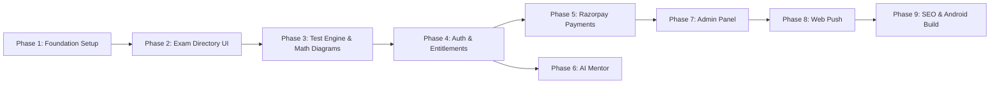

# Build Plan — OdishaExamPrep

This document serves as the step-by-step implementation guide to rebuild the **OdishaExamPrep** (`https://www.odishaexamprep.in`) platform from scratch. It documents exclusively what exists in the current project.

---

## Core Development Principles

- **Methodology:** Feature-Driven Development (FDD) following UI-first implementation.
- **Build Philosophy:**
  1. Build complete UI first using mock data.
  2. Verify UI visually and test responsive layouts across Mobile, Tablet, and Desktop.
  3. Connect frontend with backend services and state management (`AuthContext`, `examService`).
  4. Implement business logic and entitlement rules (`entitlementEngine.ts`).
  5. Connect database tables and PostgreSQL Row Level Security (RLS) policies.
  6. Connect external APIs (Razorpay, NVIDIA NIM AI, WebPush).
  7. Verify feature completeness against testing criteria before proceeding to the next phase.
- **Definition of Done:** A feature is marked complete ONLY when its UI, state management, backend integration, database security policies, error handling, loading states, and mobile responsiveness are fully verified.

---

## Development Rules

1. Never build backend logic before the complete UI mockup exists and is visually verified.
2. Never connect external APIs (Razorpay, NVIDIA NIM) before UI layout and mock states exist.
3. Never skip loading states (skeleton loaders or pulse spinners) for asynchronous data fetches.
4. Never skip error handling (toast alerts or fallback UI) for API or database network failures.
5. Never skip mobile responsive layouts (test breakpoints: `<640px`, `640px–1024px`, `>1024px`).
6. Never duplicate business logic (centralize entitlement rules inside `entitlementEngine.ts`).
7. Never place UI code inside server scripts or database files (`server.ts` handles API routes only).
8. Never expose secret keys (`SUPABASE_SERVICE_ROLE_KEY`, `RAZORPAY_KEY_SECRET`) to the browser client.
9. Always sanitize user-generated explanations and math markup using `DOMPurify`.
10. Always resolve Razorpay transaction prices server-side from the database to prevent pricing tampering.

---

## BUILD PHASES

### Phase 1 — Project Setup & Design System Foundation

#### Feature 01 — Core Design System & Layout Shell

##### Goal
Establish Vite + React 19 + TypeScript + Tailwind CSS v4 environment, global HSL color tokens (`brand-600`), typography, KaTeX CSS, and the responsive main layout shell (`PageLayout.tsx` header/footer).

##### UI
- **Header:** Sticky top navigation bar containing the website logo (`BookOpen` icon + "OdishaExamPrep" title), exam category navigation links, search trigger, and Auth profile / Admin portal login button.
- **Footer:** Links to legal policies (Privacy, Terms, Refund Policy), exam categories, copyright info, and social links.
- **Desktop/Tablet/Mobile Layout:** Header collapses into a mobile slide-out drawer on `<768px` screens.

##### User Interaction
- Toggling mobile menu drawer.
- Navigating between main portal routes (`/`, `/blog`, `/ai-mentor`).

##### Backend Logic
- Express static file serving configuration in `server.ts`.

##### Database
- None required for static layout shell.

##### APIs
- `/api/version` (`GET`) — Server health check returning version `1.1.4`.

##### State Management
- Local `useState` for mobile drawer toggle.

##### Error Handling
- Global React `ErrorBoundary.tsx` catching client rendering crashes.

##### Loading States
- Pulse animation for initial page bootstrap (`LoadingPortal.tsx`).

##### Empty States
- Custom 404 page (`NotFoundPage.tsx`) for unmatched client routes.

##### Notifications
- Global `react-hot-toast` container setup in `App.tsx`.

##### Analytics Events
- `page_view` trigger on route changes.

##### Security
- Content Security Policy headers, DOMPurify HTML sanitization.

##### Testing Checklist
- [x] Verify Vite build runs without TypeScript errors (`npm run build`).
- [x] Check mobile drawer open/close on mobile viewports.
- [x] Confirm KaTeX CSS styles render properly.

##### Completion Criteria
- Layout shell renders header and footer cleanly across desktop and mobile devices.

---

### Phase 2 — Public Portal & Home Interface

#### Feature 02 — Exam Directory & Category Cards

##### Goal
Provide students with a visual directory of Odisha state exams (OPSC, OSSC, OSSSC) with category filters, test counts, and quick-launch action buttons.

##### UI
- **Hero Banner:** Promotional banner with platform value proposition, student toppers badge, and quick search bar.
- **Exam Cards Grid:** Responsive card grid displaying exam name, icon, total available mock tests, syllabus breakdown link, and pricing badge ("Free" or "Premium").
- **Desktop/Mobile:** 3 columns on desktop (`lg:grid-cols-3`), 2 on tablet, 1 on mobile.

##### User Interaction
- Student clicks an exam card to navigate to `/exams/:examId`.

##### Backend Logic
- Fetching active exams from Supabase `exams` table, filtering out archived entries (`is_archived === false`).

##### Database
- Table: `public.exams` (`id`, `name`, `description`, `category`, `createdAt`, `is_archived`).

##### APIs
- Direct Supabase Client read query: `supabase.from('exams').select('*')`.

##### State Management
- `AuthContext.tsx` holds catalog data in memory.

##### Loading States
- Skeleton card grid (`Array.from({ length: 6 })`) displaying pulse animations during fetch.

##### Empty States
- "No exams found matching your query" message when search filter yields zero items.

##### Completion Criteria
- Home page loads exam cards from database dynamically with working search and filter functions.

---

### Phase 3 — Mock Test Engine & Universal Math Diagram Engine

#### Feature 03 — Timed Exam Simulator & Diagram Renderer

##### Goal
Provide a full-featured online test simulator (`MockTestSystem.tsx`) with countdown timer, question palette, answer submission, and dynamic mathematical diagram rendering (`UniversalMathDiagramEngine.tsx`).

##### UI
- **Header Control Bar:** Test title, remaining time countdown clock, mode badge ("Official Mock" vs "Practice Mode"), Submit Test button.
- **Question Viewport:** Question text rendered via `MathTextRenderer.tsx`, option selector radios (A, B, C, D), dynamic SVG/Canvas geometric diagram container, and detailed solution accordion.
- **Side Palette:** Question index grid displaying status colors:
  - Gray: Not Visited
  - Red: Skipped / Unanswered
  - Green: Answered
  - Purple: Marked for Review
- **Responsive Layout:** Side palette slides out on mobile screens via bottom sheet drawer.

##### User Interaction
- Student selects option A/B/C/D -> Status updates to Green.
- Student clicks "Mark for Review" -> Status updates to Purple.
- Student clicks "Submit Exam" -> Confirmation dialog appears -> Score calculated and saved.

##### Backend Logic
- Score calculation: `(Correct * PositiveMarks) - (Incorrect * NegativeMarks)`.
- Attempt record creation in `public.attempts`.

##### Database
- Read: `public.questions`, `public.mockTests`.
- Write: `public.attempts` (`id`, `user_id`, `test_id`, `score`, `total_questions`, `time_spent`, `answers`, `created_at`).

##### APIs
- `supabase.from('questions').select('*').eq('examId', examId)`.

##### Universal Math Diagram Engine Logic
- Parses `diagram` JSON object in question record.
- Renders SVG paths, coordinate planes, circles, triangles, flowcharts, or circuit diagrams.
- Overlays KaTeX math labels directly onto geometric coordinates.

##### State Management
- Local `useReducer` managing `currentQuestionIndex`, `userAnswers`, `flaggedQuestions`, `timeRemainingSeconds`, and `testStatus` ('intro' | 'active' | 'completed').

##### Error Handling
- Network disconnection alert during submission; saves attempt in browser `localStorage` as emergency backup.

##### Completion Criteria
- Complete timed test execution, SVG diagram rendering, score generation, and database submission verified.

---

### Phase 4 — Authentication & Entitlement Access Engine

#### Feature 04 — Supabase Auth & Entitlement Resolution

##### Goal
Authenticate users via Supabase Auth (Email/Password), manage user sessions, and compute user content entitlements in `entitlementEngine.ts`.

##### UI
- **Auth Modal:** Tabs for "Sign In" and "Create Account", email/password input fields, error alert banner, and loading spinner.
- **Profile Header Dropdown:** Displays user email, purchased series count, and logout button.

##### Backend Logic
- Session management via Supabase Auth.
- Entitlement hierarchy check (`entitlementEngine.ts`) resolving access based on active records in `public.user_purchases`.

##### Database
- Table: `public.user_purchases` (`user_id`, `product_id`, `product_type`, `price_paid`, `status`).

##### APIs
- Supabase Auth SDK (`signInWithPassword`, `signUp`, `signOut`).
- Server token caching middleware (`server.ts` 2-minute memory cache).

##### Completion Criteria
- User registration, login, logout, and automatic entitlement unlocking verified.

---

### Phase 5 — Razorpay Payment Gateway Integration

#### Feature 05 — Server-Verified Content Monetization

##### Goal
Enable users to purchase premium exam bundles and test series via Razorpay with server-side price validation and automatic account entitlement updates.

##### UI
- **Unlock Modal:** Displays product name, price (e.g. ₹499), list of included features, and "Proceed to Pay" button.
- **Razorpay Checkout Overlay:** Native Razorpay payment sheet (UPI QR, Credit/Debit Card, NetBanking, Wallets).

##### User Interaction
1. User clicks "Unlock Now" on a locked exam bundle.
2. Server API `/api/payment/order` generates a Razorpay Order ID.
3. Razorpay Checkout opens; user completes payment.
4. Client posts payment signature to `/api/payment/verify`.
5. Server verifies signature via HMAC SHA-256, records purchase in `public.user_purchases`, and syncs `user_metadata.purchasedSeries` in Supabase Auth.
6. UI immediately updates to show content unlocked.

##### Backend Logic & APIs
- `POST /api/payment/order`: Resolves official price from DB and creates order.
- `POST /api/payment/verify`: Verifies payment signature and grants entitlement.
- `POST /api/payment/check-status`: Direct order verification fallback.
- `POST /api/payment/webhook`: Asynchronous webhook handler for `payment.captured` events.

##### Security
- HMAC SHA-256 cryptographic verification using `RAZORPAY_KEY_SECRET`.
- Server-side price resolution prevents client-side price tampering.

##### Completion Criteria
- Successful test purchase flow, signature verification, and instant entitlement unlock verified end-to-end.

---

### Phase 6 — AI Mentor & Doubt Resolution Companion

#### Feature 06 — NVIDIA NIM AI Chat Integration

##### Goal
Provide 24/7 AI-powered tutoring workspace (`AiMentor.tsx`) and floating companion widget (`StickyAICompanion.tsx`) using server-proxied NVIDIA NIM / Llama 3.1 8B inference.

##### UI
- **AI Mentor Page (`AiMentor.tsx`):** Chat thread container, prompt suggestion chips, message input text area, and math LaTeX solution cards.
- **Sticky Companion (`StickyAICompanion.tsx`):** Floating action button opening a side drawer during tests.

##### APIs
- `POST /api/chat/completions`: Server proxy forwarding requests to NVIDIA NIM API (`integrate.api.nvidia.com/v1`) with Server-Sent Events (SSE) streaming.

##### AI Configuration
- Model: `meta/llama-3.1-8b-instruct`.
- System Prompt: Formatted as an expert Odisha competitive exam tutor using LaTeX delimiters (`$...$`).

##### Completion Criteria
- Streaming AI chat responses render correctly with KaTeX math formatting.

---

### Phase 7 — Administrative Management Suite

#### Feature 07 — Content, User & Notification Control Center

##### Goal
Provide site administrators with a full control panel (`AdminPanel.tsx`) for managing questions, users, push notifications, and revenue analytics.

##### UI
- **Admin Dashboard:** Sidebar navigation tabs (Overview, Questions, Users, Push Notifications, Revenue).
- **Questions Manager:** Paginated questions table with filters, search bar, and Bulk JSON Upload modal.
- **Push Notification Composer:** Form to write title, body, target audience (All vs. Specific Users), schedule time, and send button.

##### APIs & Backend
- `GET /api/admin/users`: Lists registered users and metadata.
- `POST /api/admin/users/update`: Modifies user metadata or grants manual entitlements.
- `GET /api/admin/questions`: Paginated question listing.
- `POST /api/admin/questions/bulk`: Bulk inserts question arrays.
- `POST /api/admin/db/:table`: Controlled write proxy for database tables.

##### Permissions
- Restricted to admin emails (`odishaexamprep365@gmail.com`, `nareshsamal99384@gmail.com`) via `requireAdmin` middleware.

##### Completion Criteria
- Bulk question upload, user entitlement granting, and push notification dispatch verified.

---

### Phase 8 — Web Push Notifications System

#### Feature 08 — VAPID Web Push Dispatcher

##### Goal
Allow users to subscribe to browser push notifications and receive real-time exam alerts.

##### UI
- **Permission Prompt (`PushPermissionPrompt.tsx`):** Banner asking users to enable notifications.

##### APIs & Database
- `GET /api/push/vapid-key`: Returns public VAPID key.
- `POST /api/push/subscribe`: Saves subscription endpoint to `public.push_subscriptions`.
- `POST /api/push/send`: Admin API dispatching web push payloads via `web-push` library.

##### Completion Criteria
- Browser subscription registration and test push notification receipt verified.

---

### Phase 9 — Performance, SEO & PWA Native Build

#### Feature 09 — SEO Middleware, Dynamic Sitemap & Mobile Build

##### Goal
Optimize website SEO for Google search engine crawlers and package the web app as a native Android APK using Capacitor.

##### SEO Implementation (`server.ts`)
- Pre-injects OpenGraph meta tags, Twitter cards, and canonical tags into Express HTML responses.
- Generates dynamic `/sitemap.xml` pulling active exams and blog posts.
- Serves `/robots.txt` and handles 301 redirects for legacy WordPress URLs.

##### Mobile Hybrid Build (`Capacitor`)
- Capacitor 8 Android configuration (`capacitor.config.ts`).
- Release APK output: `app-release.apk` located in root directory.

##### Completion Criteria
- Validated XML sitemap output and verified Android APK compilation.

---

## Overall Project Timeline

| Phase | Module | Estimated Effort |
| :--- | :--- | :--- |
| **Phase 1** | Project Setup & Design System Foundation | 2 Days |
| **Phase 2** | Public Portal & Exam Directory | 3 Days |
| **Phase 3** | Mock Test Simulator & Universal Math Diagram Engine | 6 Days |
| **Phase 4** | Authentication & Entitlement Engine | 3 Days |
| **Phase 5** | Razorpay Payment Gateway Integration | 4 Days |
| **Phase 6** | AI Mentor & NVIDIA NIM Companion | 4 Days |
| **Phase 7** | Administrative Control Suite | 5 Days |
| **Phase 8** | Web Push Notifications System | 2 Days |
| **Phase 9** | Performance, SEO & Native Android APK | 3 Days |
| **Total** | Full Platform Rebuild | **32 Days** |

---

## Critical Path

---

## Feature Dependency Graph

- **Mock Test Engine (Phase 3)** depends on **Design System & Math Renderer (Phase 1 & 3)**.
- **Entitlement Engine (Phase 4)** depends on **Supabase Database & Auth (Phase 4)**.
- **Razorpay Monetization (Phase 5)** depends on **Auth & Entitlement Engine (Phase 4)**.
- **Admin Management Suite (Phase 7)** depends on **Auth Role Middleware & DB Proxies (Phase 4 & 7)**.
- **Web Push Notifications (Phase 8)** depends on **Service Worker (`sw.js`) & Admin Suite (Phase 7)**.

---

## Production & Deployment Checklist

- [x] All environment variables configured in production server (`.env`).
- [x] Supabase Row Level Security (RLS) policies enabled on all tables.
- [x] Razorpay webhook listener endpoint verified (`/api/payment/webhook`).
- [x] NVIDIA NIM API key proxy verified (`/api/chat/completions`).
- [x] Express SEO meta injection middleware tested against social media preview debuggers.
- [x] Dynamic `/sitemap.xml` rendering verified.
- [x] Android release APK compiled and verified (`app-release.apk`).
