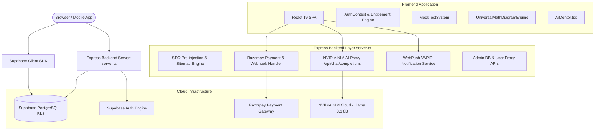

# Project Overview — OdishaExamPrep

> **OdishaExamPrep** (`https://www.odishaexamprep.in`) is an enterprise-grade, full-stack educational exam preparation platform engineered specifically for Odisha state competitive examinations (OPSC, OSSC, OSSSC, OSSC CGL, RI/AMIN, Odisha Police, and teaching exams).

---

## 1. About the Product

- **Product Name:** OdishaExamPrep (OEP)
- **Primary Purpose:** Provide Odisha job aspirants with an all-in-one preparation ecosystem including full-length mock tests, topic-wise practice modules, AI-powered interactive mentorship, custom geometric math diagram rendering, real-time analytics, and instant state-rank estimation.
- **Business Goal:** Offer affordable, high-quality exam prep resources tailored to official exam patterns while monetizing through premium exam bundles, test series, and full platform access passes via Razorpay.
- **Value Proposition:** 
  - **Localized Exam Focus:** 100% alignment with Odisha state exam patterns, syllabus breakdowns, and previous year trends.
  - **AI Learning Companion:** Built-in NVIDIA NIM (DeepSeek / Llama 3.1) AI mentor for instant doubt resolution and LaTeX math explanations.
  - **Universal Math Diagram Engine:** Native rendering of dynamic geometric shapes, graphs, coordinate planes, and circuit diagrams directly in questions.
  - **Offline/PWA & Mobile Native Readiness:** Full support for Web App, PWA push notifications, and Android APK deployment (via Capacitor).

---

## 2. Problem It Solves

| Problem Faced by Aspirants | Existing Market Limitations | OdishaExamPrep Solution |
| :--- | :--- | :--- |
| Lack of Odisha-specific mock tests | Generic national prep platforms ignore state-specific Odisha GK, Odia language, and local exam nuances. | Curated question banks strictly mapped to OPSC, OSSC, and OSSSC syllabi. |
| Complex Math & Geometry questions | Most web test engines only support plain text or static low-resolution image diagrams. | Dynamic SVG/Canvas renderer (`UniversalMathDiagramEngine`) with interactive geometry, angles, and KaTeX math formulas. |
| Slow/Expensive Doubt Resolution | Private coaching and 1-on-1 tutoring are expensive and slow. | Integrated AI Mentor (`AiMentor.tsx`) with zero-latency chat completions for step-by-step solutions. |
| Unreliable entitlement sync after payment | Users pay on web/mobile but experience delays or manual key entry to unlock tests. | Dual-layer Razorpay verification: client signature verification + server-side webhook + auto-entitlement ledger in Supabase Auth metadata. |

---

## 3. Target Users

1. **Primary Users:**
   - Job aspirants preparing for **OPSC** (Civil Services, Assistant Section Officer), **OSSC** (CGL, CHSL, CTS), and **OSSSC** (RI, AMIN, ICDS Supervisor, Livestock Inspector, Panchayat Executive Officer).
   - Students preparing for Odisha Police Constable/SI, B.Ed/CT entrance exams.
2. **Secondary Users:**
   - Content creators, subject matter experts, and teachers managing test series and questions.
3. **Platform Administrators:**
   - Platform owners managing question banks, user entitlements, automated push notifications, system diagnostics, and financial transactions.

---

## 4. Technology Stack

### Frontend
- **Framework:** React 19 SPA (`react`, `react-dom`)
- **Routing:** React Router v7 (`react-router-dom`)
- **Styling:** Tailwind CSS v4 (`@tailwindcss/vite`, `tailwindcss`), Custom CSS design tokens (`index.css`)
- **Animations:** Framer Motion (`framer-motion`, `motion`)
- **Icons:** Lucide React (`lucide-react`)
- **Math Rendering:** KaTeX (`katex`, `react-katex`), Custom Universal Math Diagram Engine
- **Data Visualization:** Recharts (`recharts`)
- **Sanitization:** DOMPurify (`dompurify`)
- **Build Tool:** Vite 6 (`vite`, `@vitejs/plugin-react`)

### Mobile Hybrid Layer
- **Cross-Platform Framework:** Capacitor 8 (`@capacitor/core`, `@capacitor/android`, `@capacitor/app`, `@capacitor/browser`, `@capacitor/keyboard`, `@capacitor/status-bar`)
- **Native APK Output:** Android Project located in `./android` (Release APK: `app-release.apk`)

### Backend & Server
- **Server Runtime:** Node.js (v22+) with Express 4 (`express`)
- **TypeScript Runtime & Bundler:** `tsx` for dev, `esbuild` for production bundle (`build/server.js`)
- **Push Notifications:** WebPush Protocol (`web-push`) with VAPID key pairs
- **SEO & Server-Side Middleware:** Express HTML pre-injection for OpenGraph, Twitter Cards, dynamic `sitemap.xml`, and `robots.txt`

### Database & Authentication
- **BaaS Platform:** Supabase (PostgreSQL 15+)
- **SDK:** `@supabase/supabase-js` (Client SDK + Service Role Admin SDK)
- **Auth:** Supabase Auth (Email/Password, User Metadata Session Entitlements, Custom Admin Email Claims)
- **Security:** PostgreSQL Row Level Security (RLS) on all content and ledger tables

### Third-Party Services & APIs
- **AI Inference Engine:** NVIDIA NIM API (Meta Llama 3.1 8B Instruct / DeepSeek model endpoints)
- **Payment Gateway:** Razorpay Payment Gateway (Orders API, Signature Verification, Webhook Listener)
- **Hosting Target:** Hostinger VPS / Node.js Server Environment with Nginx reverse proxy

---

## 5. Folder Structure

```
OdishaExamPrep Website/
├── .env                       # Local environment secrets
├── .env.example               # Environment template
├── android/                   # Capacitor Android native project
├── build/                     # Production build output (frontend dist + server.js)
├── public/                    # Static assets (favicons, manifests, sw.js, audio)
│   ├── android-chrome-192x192.png
│   ├── favicon.svg            # Primary SVG Logo
│   ├── notification.mp3       # Sound notification trigger
│   ├── site.webmanifest       # PWA manifest definition
│   └── sw.js                  # Push Notification Service Worker
├── server.ts                  # Backend Express server (APIs, Payments, Push, SEO, AI Proxy)
├── supabase/                  # Database schema migrations & RLS policies
│   └── migrations/
│       ├── 20260614000000_create_user_purchases_and_archive.sql
│       ├── 20260615000000_secure_content_tables.sql
│       ├── 20260615010000_enable_attempts_table.sql
│       ├── 20260616094600_diagram_telemetry.sql
│       ├── 20260623094000_create_activities_table.sql
│       └── 20260705000000_push_notifications.sql
└── src/
    ├── AdminPanel.tsx         # Comprehensive Admin Management Suite
    ├── AnalyticsView.tsx      # Performance & Accuracy Analytics View
    ├── App.tsx                # Main Application Shell & Core Routing Logic
    ├── ErrorBoundary.tsx      # Global React Error Catching Component
    ├── MockTestSystem.tsx     # Full Test Taking Engine (Timer, Palette, Submit)
    ├── TestResultsView.tsx    # Comprehensive Result Breakdown & Rank Analytics
    ├── components/            # Reusable UI & Logic Components
    │   ├── AnimatedRoutes.tsx
    │   ├── Button.tsx
    │   ├── ChangeImpactModal.tsx
    │   ├── DiagramTemplateSelector.tsx
    │   ├── LoadingPortal.tsx
    │   ├── MathTextRenderer.tsx
    │   ├── OnboardingTour.tsx
    │   ├── PageLayout.tsx
    │   ├── ProtectedRoute.tsx
    │   ├── PushPermissionPrompt.tsx
    │   ├── SearchableSelect.tsx
    │   ├── StickyAICompanion.tsx
    │   ├── TimePicker.tsx
    │   ├── UniversalMathDiagramEngine.tsx # Canvas/SVG Math Diagram Generator
    │   └── YouTubeCarousel.tsx
    ├── hooks/                 # Custom React Hooks
    ├── lib/                   # Utility Libraries & Core State Managers
    │   ├── AuthContext.tsx           # Global Auth & Entitlement Provider
    │   ├── activityTracker.ts        # User Attempt & Streak Tracker
    │   ├── aiDiagnosticManager.ts    # AI Error & Diagnostic Assistant
    │   ├── animations.ts             # Motion Variant Definitions
    │   ├── capacitorShim.ts          # Native Device Bridge
    │   ├── defaultAchievers.ts       # Platform Topper Testimonials Data
    │   ├── entitlementEngine.ts      # Client Entitlement Resolution
    │   ├── entitlementManager.ts     # User Access Control Ledger Sync
    │   ├── examService.ts            # Supabase Data Fetching Abstraction
    │   ├── pushNotifications.ts      # Push Subscription Registration Manager
    │   ├── routes-config.ts          # Express Server Route Match Matrix
    │   ├── scrollManager.ts          # Smooth Scroll & View Reset Utility
    │   ├── supabase.ts               # Supabase Client Initialization
    │   └── utils.ts                  # Classname Merger (clsx + tailwind-merge)
    ├── pages/                 # Full Page Components
    │   ├── AdminDashboardPage.tsx
    │   ├── AdminLoginPage.tsx
    │   ├── AiMentor.tsx              # Interactive AI Tutoring Workspace
    │   ├── BlogList.tsx              # Exam Articles & Preparation News
    │   ├── BlogPost.tsx              # Article Detail Page with Schema Markup
    │   └── NotFoundPage.tsx          # Custom 404 Fallback
    ├── index.css              # Design Tokens & Global Styles
    └── main.tsx               # React Application Entrypoint
```

---

## 6. Architecture



---

## 7. Pages

| Page Name | Route | Key Components | Purpose & Description |
| :--- | :--- | :--- | :--- |
| **Home / Portal** | `/` | Header, Hero, Exam Cards, AI Companion, Testimonials | Central discovery hub showing exam categories, syllabus roadmaps, and quick launch pads for tests. |
| **Exam Overview** | `/exams/:examId` | Exam Details, Syllabus Tree, Test Series Cards | Displays full syllabus breakdown, mock test series, and purchase buttons for a specific exam. |
| **Practice Mode** | Inline / Modal | `MockTestSystem`, `MathTextRenderer` | Instant untimed practice mode with immediate answer explanations and AI assistance. |
| **Mock Test Engine** | `/test/:testId` | Question Palette, Timer, Question Viewer, Calculator | Real-time timed exam simulator matching official exam duration, marking scheme, and rules. |
| **Test Results** | `/results/:attemptId` | Score Card, Rank Estimator, Detailed Solutions, Subject Graph | Full performance breakdown showing section-wise marks, accuracy %, solution reviews, and rank among peers. |
| **Analytics View** | `/analytics` | `AnalyticsView`, Recharts Charts, Weakness Radar | Student analytics dashboard displaying historical progress, attempt streaks, and subject strength heatmaps. |
| **AI Mentor** | `/ai-mentor` | `AiMentor`, Chat Thread, LaTeX Renderer, Prompt Library | 24/7 AI tutor specialized in Odisha GK, English grammar, Quantitative Aptitude, and Reasoning. |
| **Blog List** | `/blog` | `BlogList`, Search Bar, Category Filters | Official news portal for exam notifications, syllabus revisions, and preparation strategies. |
| **Blog Post** | `/blog/:id` | `BlogPost`, Schema Markup, Author Bio | Detailed strategy guide with pre-rendered SEO schema markup for search engines. |
| **Admin Login** | `/admin-login` | `AdminLoginPage`, Dual Auth Form | Secure login portal for site administrators to authenticate via environment/Supabase auth. |
| **Admin Dashboard**| `/admin` | `AdminPanel`, Question Manager, User Ledger, Push Composer | Full administrative command center for content upload, user entitlement management, push notifications, and revenue analytics. |
| **Legal Pages** | `/privacy-policy`, `/terms-of-service`, `/refund-policy` | `PrivacyPolicy`, `TermsOfService`, `RefundPolicy` | Official compliance documents required for payment gateway onboarding and user privacy. |

---

## 8. Complete User Flows

### A. Student Registration & Test Purchase Workflow
1. Guest user explores `/` or `/exams/opsc-aio`.
2. Selects a locked **Premium Exam Bundle** or **Test Series** and clicks **Unlock Now**.
3. If not logged in, Supabase Auth modal prompts for Email/Password registration.
4. Client initiates `/api/payment/order` via Express server to create a Razorpay Order ID.
5. Razorpay Checkout modal appears. User pays via UPI, Card, NetBanking, or Wallet.
6. Upon payment success, frontend posts signature to `/api/payment/verify`.
7. `server.ts` verifies HMAC SHA-256 signature, validates price paid against database, updates `public.user_purchases` ledger, and synchronizes `user_metadata.purchasedSeries` in Supabase Auth.
8. Instant UI state update unlocks all premium mock tests for the user.

### B. Mock Test Taking Workflow
1. User clicks **Start Mock Test**.
2. `MockTestSystem.tsx` initializes question array and starts test timer.
3. User selects answers, flags questions for review, or views rendered geometric diagrams.
4. Upon clicking **Submit Exam**, attempt payload (responses, time taken, score) is calculated and saved to `public.attempts` table in Supabase.
5. User is immediately redirected to `TestResultsView` to view total score, state rank estimate, and topic-wise accuracy.

---

## 9. Authentication & Access Control

- **Auth Engine:** Supabase Auth (JWT tokens stored securely in client storage).
- **Session Caching:** Backend `server.ts` implements a 2-minute memory cache (`tokenCache`) for Supabase token verification to optimize API performance.
- **Protected Content:** Database level protection using **Row Level Security (RLS)** policies on `mockTests` and `questions` tables.
- **Admin Authentication:**
  - Hardcoded admin emails (`odishaexamprep365@gmail.com`, `nareshsamal99384@gmail.com`) + Supabase Auth metadata role checks (`role === 'admin'`).
  - Separate `/api/admin/login` route synchronizes administrative credentials with Supabase Auth.

---

## 10. Exam & Question Engine Details

- **Supported Question Formats:** Multiple Choice Questions (MCQ) with 4 options, single correct option, detailed text & mathematical explanations.
- **Universal Math Diagram Engine (`UniversalMathDiagramEngine.tsx`):**
  - Converts JSON diagram specifications into vector-rendered SVG/Canvas graphics.
  - Supports shapes: Triangles, Circles, Polygons, Coordinate Grids, Venn Diagrams, Flowcharts, Circuits.
  - Includes KaTeX integration to overlay mathematical symbols on top of geometric diagrams.
- **Score Calculation Logic:**
  - Standard positive score per correct question (e.g. +1.0 or +2.0 depending on exam type).
  - Negative marking deduction for incorrect answers (e.g. -0.25 or -0.33).
  - Unattempted questions receive 0 marks.

---

## 11. AI Features (NVIDIA NIM / DeepSeek)

- **Backend Proxy (`/api/chat/completions`):**
  - Encapsulates NVIDIA NIM API keys safely on the server.
  - Connects to `meta/llama-3.1-8b-instruct` / DeepSeek models with full Server-Sent Events (SSE) streaming support.
  - Custom system prompt injects Odisha exam guidelines, syllabus constraints, and step-by-step problem-solving instructions.
- **Sticky AI Companion Component (`StickyAICompanion.tsx`):**
  - Floating widget available across all test pages.
  - Provides instant hint generation without revealing full answers during practice mode.

---

## 12. Admin Panel Features (`AdminPanel.tsx`)

1. **User Management:** View registered users, view purchase histories, manually grant or revoke full access passes or specific test series.
2. **Bulk Question Upload:** JSON uploader interface to upload hundreds of questions simultaneously with automated schema validation and diagram detection.
3. **Push Notification Center:** Compose, target (All users / specific user IDs), schedule, and track web push notifications with delivery statistics.
4. **Database Proxy Endpoint:** Secure server route (`/api/admin/db/:table`) to perform CRUD operations on catalog tables bypassing client RLS restrictions.
5. **Content Revocation:** Single-click tool to deactivate user purchases and strip entitlements in bulk.

---

## 13. Database Schema Overview

```sql
-- Core User Purchases Ledger Table
CREATE TABLE public.user_purchases (
  id UUID DEFAULT gen_random_uuid() PRIMARY KEY,
  user_id UUID NOT NULL,
  product_id TEXT NOT NULL,
  product_type TEXT NOT NULL, -- 'system' | 'exam_bundle' | 'test_series' | 'mock_test' | 'question_bank'
  price_paid NUMERIC(10, 2) NOT NULL DEFAULT 0.00,
  razorpay_order_id TEXT,
  razorpay_payment_id TEXT,
  purchase_date TIMESTAMP WITH TIME ZONE DEFAULT NOW() NOT NULL,
  snapshot JSONB,
  status TEXT NOT NULL DEFAULT 'active',
  CONSTRAINT unique_user_product UNIQUE (user_id, product_id)
);

-- Push Notifications Subscriptions
CREATE TABLE public.push_subscriptions (
  id UUID PRIMARY KEY DEFAULT gen_random_uuid(),
  user_id UUID REFERENCES auth.users(id) ON DELETE CASCADE,
  endpoint TEXT NOT NULL,
  p256dh TEXT NOT NULL,
  auth TEXT NOT NULL,
  device_info JSONB DEFAULT '{}',
  is_active BOOLEAN DEFAULT true,
  created_at TIMESTAMPTZ DEFAULT now(),
  updated_at TIMESTAMPTZ DEFAULT now(),
  UNIQUE(user_id, endpoint)
);

-- Push Notification History & Analytics
CREATE TABLE public.push_notifications (
  id UUID PRIMARY KEY DEFAULT gen_random_uuid(),
  title TEXT NOT NULL,
  body TEXT NOT NULL,
  icon TEXT DEFAULT '/android-chrome-192x192.png',
  image_url TEXT,
  click_url TEXT DEFAULT '/',
  data JSONB DEFAULT '{}',
  target_type TEXT NOT NULL DEFAULT 'all',
  target_ids TEXT[] DEFAULT '{}',
  status TEXT NOT NULL DEFAULT 'pending',
  scheduled_at TIMESTAMPTZ,
  sent_at TIMESTAMPTZ,
  created_by UUID REFERENCES auth.users(id),
  created_at TIMESTAMPTZ DEFAULT now(),
  delivery_stats JSONB DEFAULT '{"total": 0, "success": 0, "failed": 0}'
);
```

Other pre-existing Supabase tables managed by the application:
- `public.users` (user profiles and roles)
- `public.exams` (exam definitions, category, pricing metadata)
- `public.testSeries` (test series catalog)
- `public.mockTests` (individual mock test metadata and rules)
- `public.questions` (question content, options, explanations, diagrams)
- `public.questionBanks` (question bank modules)
- `public.attempts` (user test attempt logs and score records)
- `public.activities` (user streak and daily activity tracking)

---

## 14. API Documentation

| Endpoint | Method | Auth Required | Description |
| :--- | :--- | :--- | :--- |
| `/api/version` | `GET` | None | Returns current application version and commit hash. |
| `/api/diag` | `GET` | None | Deep diagnostic tool checking server environment and build files. |
| `/api/admin/login` | `POST` | None | Admin authentication endpoint. |
| `/api/admin/users` | `GET` | Admin | Returns list of registered users and metadata. |
| `/api/admin/users/update` | `POST` | Admin | Updates user metadata or syncs purchased series. |
| `/api/admin/questions` | `GET` | Admin | Paginated & filtered list of questions. |
| `/api/admin/questions/bulk`| `POST` | Admin | Bulk inserts an array of question objects. |
| `/api/admin/db/:table` | `POST` | Admin | Controlled proxy for database writes. |
| `/api/payment/order` | `POST` | None | Generates a Razorpay Order ID. |
| `/api/payment/verify` | `POST` | None | Verifies Razorpay signature & credits user account. |
| `/api/payment/check-status`| `POST`| None | Direct Razorpay order status verification bypassing webhooks. |
| `/api/payment/webhook` | `POST` | Webhook Secret | Razorpay asynchronous event handler (`payment.captured`). |
| `/api/push/vapid-key` | `GET` | None | Returns public VAPID key for web push. |
| `/api/push/subscribe` | `POST` | None | Saves a Web Push subscription. |
| `/api/push/send` | `POST` | Admin | Sends or schedules push notifications. |
| `/api/chat/completions` | `POST` | Rate-limited | Proxy endpoint for NVIDIA NIM AI chat completions. |
| `/sitemap.xml` | `GET` | None | Dynamically generated XML sitemap for SEO crawlers. |
| `/robots.txt` | `GET` | None | Search engine crawler rules. |

---

## 15. Design System

- **Primary Colors:** Brand Blue (`#2563EB` / `brand-600`), Indigo (`#4F46E5`), Dark Slate background accents (`#0F172A`).
- **Typography:** Modern clean sans-serif (Inter / Outfit font fallback stack).
- **Component Styling:** Card-based UI layouts with subtle borders (`border-slate-200/80`), frosted glass overlays, and rounded corners (`rounded-2xl`).
- **Responsive Breakpoints:** Fully fluid layouts tailored for Mobile (`<640px`), Tablet (`640px - 1024px`), and Desktop (`>1024px`).

---

## 16. SEO & Social Sharing

- **Server-Side Meta Injection Middleware (`server.ts`):** Pre-injects `<title>`, `<meta name="description">`, `<meta name="keywords">`, `<link rel="canonical">`, OpenGraph (`og:image`), and Twitter cards directly into HTML responses before delivering to search bots.
- **Structured Data (JSON-LD):** Automatically generates Schema.org `WebSite` markup for the home page and `BlogPosting` markup for articles.
- **WordPress 301 Redirect Engine:** Built-in server redirects for legacy URLs (e.g. `/shop*`, `/courses*`, `/category*`) to prevent 404 links and preserve search engine rank equity.

---

## 17. Environment Variables (.env)

```env
# Admin Panel Credentials
ADMIN_EMAIL=odishaexamprep365@gmail.com
ADMIN_PASSWORD=your_admin_password

# Supabase Database Configuration
VITE_SUPABASE_URL=https://your-supabase-project.supabase.co
VITE_SUPABASE_ANON_KEY=your_supabase_anon_public_key
SUPABASE_SERVICE_ROLE_KEY=your_supabase_service_role_key

# Razorpay Payment Gateway Configuration
RAZORPAY_KEY_ID=rzp_live_your_key_id
RAZORPAY_KEY_SECRET=your_razorpay_secret
VITE_RAZORPAY_KEY_ID=rzp_live_your_key_id

# NVIDIA NIM AI Model API Configuration
VITE_DEEPSEEK_API_KEY=your_nvidia_nim_api_key
VITE_DEEPSEEK_BASE_URL=https://integrate.api.nvidia.com/v1

# Web Push Notification VAPID Configuration
VAPID_PUBLIC_KEY=your_vapid_public_key
VAPID_PRIVATE_KEY=your_vapid_private_key
VITE_VAPID_PUBLIC_KEY=your_vapid_public_key
```

---

## 18. Clarifying Questions for Platform Owner

To ensure this document is 100% comprehensive, please provide input on the following operational items if desired:

1. **Production Hosting Environment:** Is Hostinger running Node.js via PM2 or Phusion Passenger under Nginx?
2. **Current Student Base & Target Traffic:** Are there specific daily active user targets or peak concurrency numbers expected during major OPSC exam announcements?
3. **SMS / Email Gateway Integration:** Do you plan to integrate an SMS service (such as Fast2SMS or Twilio) or an Email service (such as SendGrid or Resend) for OTP verification and automated transactional email receipts in the future?
