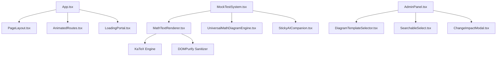

# UI Registry — OdishaExamPrep

This document is the living component registry for **OdishaExamPrep** (`https://www.odishaexamprep.in`). It catalogues every reusable UI component in the codebase.

Before creating any new component, developers and AI agents MUST consult this registry to reuse or extend existing components.

---

## How to Use

1. **Search First:** Before creating a UI component, search this registry.
2. **Reuse Before Creating:** If an existing component satisfies the requirement, use it.
3. **Extend Don't Duplicate:** If an existing component requires minor additions, add optional props to extend it.
4. **Register Immediately:** When a new reusable component is added or modified, update this registry.

---

## Component Index

| Component Name | Category | File Path | Variants | Used By | Status |
| :--- | :--- | :--- | :--- | :--- | :--- |
| **`PageLayout`** | Layout | [`src/components/PageLayout.tsx`](file:///c:/Users/Naresh%20Samal/Downloads/OdishaExamPrep%20Website/src/components/PageLayout.tsx) | Default, Full Width | All Page Views | Active |
| **`Button`** | Utility | [`src/components/Button.tsx`](file:///c:/Users/Naresh%20Samal/Downloads/OdishaExamPrep%20Website/src/components/Button.tsx) | Primary, Secondary, Glass | App.tsx, AdminPanel.tsx | Active |
| **`MathTextRenderer`** | Data Display | [`src/components/MathTextRenderer.tsx`](file:///c:/Users/Naresh%20Samal/Downloads/OdishaExamPrep%20Website/src/components/MathTextRenderer.tsx) | Inline, Block Math | MockTestSystem, BlogPost | Active |
| **`UniversalMathDiagramEngine`**| Data Display | [`src/components/UniversalMathDiagramEngine.tsx`](file:///c:/Users/Naresh%20Samal/Downloads/OdishaExamPrep%20Website/src/components/UniversalMathDiagramEngine.tsx) | Canvas, Vector SVG | MockTestSystem, AdminPanel | Active |
| **`DiagramTemplateSelector`** | Form Control | [`src/components/DiagramTemplateSelector.tsx`](file:///c:/Users/Naresh%20Samal/Downloads/OdishaExamPrep%20Website/src/components/DiagramTemplateSelector.tsx) | Modal Grid | AdminPanel.tsx | Active |
| **`StickyAICompanion`** | AI Assistant | [`src/components/StickyAICompanion.tsx`](file:///c:/Users/Naresh%20Samal/Downloads/OdishaExamPrep%20Website/src/components/StickyAICompanion.tsx) | Drawer, Floating FAB | MockTestSystem, App.tsx | Active |
| **`OnboardingTour`** | Feedback / Tour | [`src/components/OnboardingTour.tsx`](file:///c:/Users/Naresh%20Samal/Downloads/OdishaExamPrep%20Website/src/components/OnboardingTour.tsx) | Desktop Popover, Mobile Action Sheet | App.tsx | Active |
| **`PushPermissionPrompt`** | Feedback | [`src/components/PushPermissionPrompt.tsx`](file:///c:/Users/Naresh%20Samal/Downloads/OdishaExamPrep%20Website/src/components/PushPermissionPrompt.tsx) | Top Banner | App.tsx | Active |
| **`ChangeImpactModal`** | Modal | [`src/components/ChangeImpactModal.tsx`](file:///c:/Users/Naresh%20Samal/Downloads/OdishaExamPrep%20Website/src/components/ChangeImpactModal.tsx) | Warning Overlay | AdminPanel.tsx | Active |
| **`SearchableSelect`** | Form Control | [`src/components/SearchableSelect.tsx`](file:///c:/Users/Naresh%20Samal/Downloads/OdishaExamPrep%20Website/src/components/SearchableSelect.tsx) | Filterable Dropdown | AdminPanel.tsx | Active |
| **`TimePicker`** | Form Control | [`src/components/TimePicker.tsx`](file:///c:/Users/Naresh%20Samal/Downloads/OdishaExamPrep%20Website/src/components/TimePicker.tsx) | Time Input | AdminPanel.tsx | Active |
| **`YouTubeCarousel`** | Media | [`src/components/YouTubeCarousel.tsx`](file:///c:/Users/Naresh%20Samal/Downloads/OdishaExamPrep%20Website/src/components/YouTubeCarousel.tsx) | Video Carousel | App.tsx | Active |
| **`LoadingPortal`** | Feedback | [`src/components/LoadingPortal.tsx`](file:///c:/Users/Naresh%20Samal/Downloads/OdishaExamPrep%20Website/src/components/LoadingPortal.tsx) | Full Screen Spinner | App.tsx | Active |
| **`WelcomeVideoModal`** | Media / Modal | [`src/components/WelcomeVideoModal.tsx`](file:///c:/Users/Naresh%20Samal/Downloads/OdishaExamPrep%20Website/src/components/WelcomeVideoModal.tsx) | YouTube Embed Modal | App.tsx | Active |
| **`AnimatedRoutes`** | Navigation | [`src/components/AnimatedRoutes.tsx`](file:///c:/Users/Naresh%20Samal/Downloads/OdishaExamPrep%20Website/src/components/AnimatedRoutes.tsx) | Motion Fade Transition | App.tsx | Active |
| **`ProtectedRoute`** | Guard | [`src/components/ProtectedRoute.tsx`](file:///c:/Users/Naresh%20Samal/Downloads/OdishaExamPrep%20Website/src/components/ProtectedRoute.tsx) | Auth Route Guard | App.tsx | Active |
| **`VoiceWaveVisualizer`** | Feedback | [`src/components/VoiceWaveVisualizer.tsx`](file:///c:/Users/Naresh%20Samal/Downloads/OdishaExamPrep%20Website/src/components/VoiceWaveVisualizer.tsx) | Equalizer waveform animation | AiMentor.tsx, StickyAICompanion.tsx | Active |

---

## Component Details

### 1. `PageLayout`
- **File Path:** [`src/components/PageLayout.tsx`](file:///c:/Users/Naresh%20Samal/Downloads/OdishaExamPrep%20Website/src/components/PageLayout.tsx)
- **Category:** Layout
- **Purpose:** Standard top-level container for all public pages, rendering the main header navigation, drawer menu, content container, and footer.
- **Props:** `children` (`ReactNode`, required), `className` (`string`, optional).
- **Styling:** `min-h-screen flex flex-col bg-[#FBF9F6]`.

```tsx
import { PageLayout } from '../components/PageLayout';

export function CustomPage() {
  return (
    <PageLayout>
      <div className="max-w-7xl mx-auto px-4 py-8">
        <h1>Page Content</h1>
      </div>
    </PageLayout>
  );
}
```

---

### 2. `MathTextRenderer`
- **File Path:** [`src/components/MathTextRenderer.tsx`](file:///c:/Users/Naresh%20Samal/Downloads/OdishaExamPrep%20Website/src/components/MathTextRenderer.tsx)
- **Category:** Data Display
- **Purpose:** Parses raw text strings containing inline (`$...$`) or block (`$$...$$`) LaTeX equations, renders them using KaTeX, and sanitizes the output with DOMPurify.
- **Props:** `text` (`string`, required), `className` (`string`, optional).
- **Dependencies:** `katex`, `dompurify`.

```tsx
import { MathTextRenderer } from '../components/MathTextRenderer';

<MathTextRenderer 
  text="Solve for x: $x^2 + 5x + 6 = 0$" 
  className="text-slate-800 text-base font-medium" 
/>
```

---

### 3. `UniversalMathDiagramEngine`
- **File Path:** [`src/components/UniversalMathDiagramEngine.tsx`](file:///c:/Users/Naresh%20Samal/Downloads/OdishaExamPrep%20Website/src/components/UniversalMathDiagramEngine.tsx)
- **Category:** Data Display
- **Purpose:** Renders dynamic vector SVG and Canvas geometric figures (triangles, circles, polygons, coordinate axes, Venn diagrams, circuits) based on structured JSON props.
- **Props:** `diagram` (`DiagramSpec`, required), `className` (`string`, optional).
- **Dependencies:** KaTeX, React Hooks.

```tsx
import { UniversalMathDiagramEngine } from '../components/UniversalMathDiagramEngine';

<UniversalMathDiagramEngine 
  diagram={{
    type: 'triangle',
    labels: { A: '(0,0)', B: '(4,0)', C: '(2,3)' },
    angles: { A: '60°', B: '60°', C: '60°' }
  }} 
/>
```

---

### 4. `StickyAICompanion`
- **File Path:** [`src/components/StickyAICompanion.tsx`](file:///c:/Users/Naresh%20Samal/Downloads/OdishaExamPrep%20Website/src/components/StickyAICompanion.tsx)
- **Category:** AI Assistant
- **Purpose:** Floating AI assistant drawer that accompanies students during mock tests and page navigation to provide live voice interaction, hints, and strategy guidance.
- **Props:** `isOpen` (`boolean`), `onClose` (`() => void`), `activeTab` (`string`), `user` (`User`), `profile` (`UserProfile`).
- **Dependencies:** `/api/chat/completions`, `useVoiceInteraction.ts`, `VoiceWaveVisualizer.tsx`, `lucide-react`.
- **Last Updated:** July 21, 2026

| Property | Class / Token |
| :--- | :--- |
| **Drawer Container** | `bg-white/95 backdrop-blur-sm border border-slate-200/80 shadow-2xl` |
| **Drawer Header** | `bg-gradient-to-r from-slate-900 via-brand-950 to-slate-900 border-b border-slate-800/90 text-white` |
| **Live Voice Button (Active)** | `bg-gradient-to-br from-emerald-500 to-teal-700 border-emerald-600 text-white shadow-emerald-500/30` |
| **Live Voice Button (Inactive)** | `bg-white hover:bg-slate-100 text-slate-700 border-slate-200/80 hover:border-emerald-300` |
| **Dictation Overlay Bar** | `bg-slate-950/95 backdrop-blur-xl border border-emerald-500/30 shadow-[0_0_20px_rgba(16,185,129,0.15)] rounded-2xl` |
| **Confirm Chip (Check ✓)** | `w-6.5 h-6.5 rounded-lg bg-emerald-500/20 hover:bg-emerald-500/90 text-emerald-300 hover:text-white border border-emerald-500/40` |
| **Cancel Chip (Close X)** | `w-6.5 h-6.5 rounded-lg bg-rose-500/20 hover:bg-rose-500/90 text-rose-300 hover:text-white border border-rose-500/40` |
| **Mute Toggle Button** | `w-7 h-7 rounded-xl border` (`bg-indigo-50 border-indigo-200 text-indigo-600` / `bg-slate-200 border-slate-300 text-slate-500`) |
| **Text — Primary** | `text-slate-800 text-sm font-normal leading-relaxed` |
| **Text — Secondary** | `text-slate-500 text-xs font-medium` |

**Pattern notes:**
- **Glassmorphic Action Chips**: Dictation confirm `[✓]` and cancel `[X]` buttons MUST use frosted glassmorphic chips (`bg-emerald-500/20`, `bg-rose-500/20`) with hover scale micro-animations instead of solid flat color blocks.
- **Flex Overflow Prevention**: Recording bars and parent flex containers MUST declare `min-w-0` across every container level, and control action buttons MUST declare `shrink-0` to guarantee on-screen visibility.
- **Single-Line Banners**: Labels inside `VoiceWaveVisualizer` MUST enforce `whitespace-nowrap shrink-0` to prevent line wrapping.
- **Auto-Scroll on Refresh/Mount**: Chat message lists in `AiMentor` and `StickyAICompanion` MUST place `<div ref={chatEndRef} />` at the bottom and use a mount `useEffect` to scroll directly to the bottom (`behavior: 'auto'`) on initial page load / refresh so users instantly see their latest messages.
- **Live Voice Control**: Clicking the green `((•))` button or the Red `X` button MUST set `setIsLiveVoiceMode(false)` synchronously to ensure auto-restart hooks cleanly halt.
- **Multi-Chat Session Manager**: OdishaExamPrep AI in `AiMentor.tsx` uses `ChatSession[]` stored in `localStorage` (`oep_ai_chat_sessions`). `+ New Chat` starts a fresh thread while `History 🕒` toggles a slide-over glassmorphic drawer (`bg-white/95 backdrop-blur-xl z-40`) featuring live search, inline title editing, and deletion.

---

### 5. `SearchableSelect`
- **File Path:** [`src/components/SearchableSelect.tsx`](file:///c:/Users/Naresh%20Samal/Downloads/OdishaExamPrep%20Website/src/components/SearchableSelect.tsx)
- **Category:** Form Control
- **Purpose:** Custom dropdown menu with built-in real-time filter search bar for long option lists.
- **Props:** `options` (`Array<{value: string, label: string}>`, required), `value` (`string`, required), `onChange` (`(val: string) => void`, required), `placeholder` (`string`, optional).

```tsx
import { SearchableSelect } from '../components/SearchableSelect';

<SearchableSelect 
  options={[{ value: 'opsc', label: 'OPSC Civil Services' }, { value: 'ossc', label: 'OSSC CGL' }]}
  value={selectedExam}
  onChange={setSelectedExam}
  placeholder="Select Exam..."
/>
```

---

### 6. `LoadingPortal`
- **File Path:** [`src/components/LoadingPortal.tsx`](file:///c:/Users/Naresh%20Samal/Downloads/OdishaExamPrep%20Website/src/components/LoadingPortal.tsx)
- **Category:** Feedback
- **Purpose:** Renders full-screen backdrop loading state with platform logo and animated pulse spinner during initial app load.

### 7. `YouTubeCarousel`
- **File Path:** [`src/components/YouTubeCarousel.tsx`](file:///c:/Users/Naresh%20Samal/Downloads/OdishaExamPrep%20Website/src/components/YouTubeCarousel.tsx)
- **Category:** Media / Carousel
- **Purpose:** Renders an infinite, auto-scrolling strategy video carousel with dynamic YouTube oEmbed title resolution, keyword category tagging, and an integrated modal video player window.
- **Props:** `videoIds` (`string[]`, optional).
- **Last Updated:** July 20, 2026

| Property | Class / Token |
| :--- | :--- |
| **Carousel Background** | `bg-[#F2EFE9]` |
| **Modal Backdrop** | `backdrop-blur-2xl bg-slate-950/85` |
| **Modal Window Header** | `bg-slate-900 border-b border-slate-800/90` |
| **Video Frame Background** | `bg-black` |
| **Border & Radius** | `border-2 border-slate-800 rounded-2xl sm:rounded-3xl` |
| **Header Text** | `text-slate-100 font-serif font-extrabold` |
| **Modal Close Button** | `w-8 h-8 sm:w-9 sm:h-9 bg-slate-800/80 hover:bg-rose-600 text-slate-400 hover:text-white rounded-xl border border-slate-700/60 transition-all duration-200 active:scale-95` |
| **Category Badges** | `Aptitude` (blue), `Strategy` (amber), `General Studies` (emerald), `Language` (purple), `Current Affairs` (rose) |

**Pattern notes:**
- Modal video lightboxes MUST use an integrated top window header bar (`bg-slate-900 border-b border-slate-800`) with the video title on the left and the close button on the top-right corner of the header.
- Never place close buttons directly over embedded `iframe` viewports, as this blocks YouTube's native player controls.
- YouTube video titles MUST be resolved dynamically via the YouTube oEmbed API (`https://noembed.com/embed?url=...`).

---

### 8. `QuizTabChips` (AI Mentor Quizzer)
- **File Path:** [`src/pages/AiMentor.tsx`](file:///c:/Users/Naresh%20Samal/Downloads/OdishaExamPrep%20Website/src/pages/AiMentor.tsx#L4851-L4880)
- **Category:** Form Control / Chips
- **Purpose:** Renders dynamic removable topic suggestion chips in the AI MCQ Quizzer workspace with symmetrical, flex-centered vector delete buttons.
- **Last Updated:** July 20, 2026

| Property | Class / Token |
| :--- | :--- |
| **Chip Container** | `inline-flex items-center gap-1.5 px-2.5 py-1 border text-[9px] font-black uppercase tracking-wider rounded-lg transition-all shrink-0 select-none` |
| **Active Chip State** | `bg-teal-500/10 border-teal-500/35 text-[#2563EB] font-bold` |
| **Inactive Chip State** | `bg-white border-slate-200 text-slate-500 hover:text-slate-700 hover:bg-slate-50` |
| **Delete Icon Button** | `w-3.5 h-3.5 rounded-full flex items-center justify-center text-slate-400 hover:text-rose-600 hover:bg-rose-100/80 transition-all ml-0.5 cursor-pointer shrink-0` |
| **Delete Vector Icon** | `<X className="w-2.5 h-2.5 stroke-[2.5]" />` |

**Pattern notes:**
- Removable tag/chip components MUST use Lucide vector icons (`<X className="w-2.5 h-2.5" />`) inside a dedicated flex-centered circular button (`w-3.5 h-3.5 rounded-full flex items-center justify-center`).
- Never use raw font text characters (`"×"` or `"x"`) for dismiss/delete buttons on chips, as font baselines cause vertical misalignment.
- Parent chip containers MUST enforce `inline-flex items-center` cross-axis alignment to keep text labels and close icons on the exact same vertical center line.

---

### 9. `AIDiagnosticsActionPlan` (Analytics Action Plan Cards)
- **File Path:** [`src/AnalyticsView.tsx`](file:///c:/Users/Naresh%20Samal/Downloads/OdishaExamPrep%20Website/src/AnalyticsView.tsx#L1649-L1680)
- **Category:** Data Display / Checklist Cards
- **Purpose:** Renders dynamic interactive checklist cards for AI diagnostic recommendations without text truncation, maintaining top alignment across multi-line tasks.
- **Last Updated:** July 20, 2026

| Property | Class / Token |
| :--- | :--- |
| **Card Container** | `p-3.5 sm:p-4 bg-slate-50/80 border border-slate-200/70 rounded-2xl flex items-start gap-3 hover:bg-white hover:border-[#2563EB]/40 transition-all duration-300` |
| **Checked State** | `bg-[#2563EB]/5 border-[#2563EB]/20` |
| **Checkbox Square** | `w-5 h-5 rounded-md border flex items-center justify-center shrink-0 mt-0.5` |
| **Active Checkbox** | `bg-emerald-500 border-emerald-400 text-white shadow-xs` |
| **Task Typography** | `text-slate-800 text-xs sm:text-sm font-semibold leading-relaxed whitespace-normal break-words` |
| **Checked Typography** | `line-through text-slate-400` |
| **Score Boost Badge** | `px-2 py-0.5 bg-emerald-50 text-emerald-700 text-[9px] font-black rounded-lg border border-emerald-200/50 uppercase` |

**Pattern notes:**
- Action plan & checklist items MUST NEVER use `truncate` or `line-clamp-1`; sentence tasks must wrap naturally using `whitespace-normal break-words`.
- Multi-line card containers MUST enforce `flex items-start` top alignment so checkboxes and score boost badges stay anchored at the top row.
- Checkbox indicators MUST use vector `<Check className="w-3.5 h-3.5 text-white stroke-[3]" />` icons instead of raw text checkmarks.

---

### 10. `OnboardingTour` (Guided Interactive Tour)
- **File Path:** [`src/components/OnboardingTour.tsx`](file:///c:/Users/Naresh%20Samal/Downloads/OdishaExamPrep%20Website/src/components/OnboardingTour.tsx)
- **Category:** Feedback / Tour
- **Purpose:** Interactive guided onboarding walkthrough with responsive desktop popover positioning and a dedicated mobile bottom action sheet drawer.
- **Last Updated:** July 21, 2026

| Property | Class / Token |
| :--- | :--- |
| **Card Background** | `bg-white` (Popover & Mobile Drawer) |
| **Backdrop Overlay** | `fill="rgba(15, 23, 42, 0.48)"` (SVG Mask, 0 backdrop blur) |
| **Border & Radius** | `border border-slate-200/90 rounded-2xl sm:rounded-3xl` (Desktop), `rounded-[2rem]` (Mobile Drawer) |
| **Spotlight Ring** | `border-2 border-brand-500 shadow-[0_0_0_2px_rgba(255,255,255,0.8),0_0_25px_rgba(37,99,235,0.7)]` |
| **Text — Primary** | `text-slate-900 font-extrabold text-base sm:text-lg` |
| **Text — Secondary**| `text-slate-600 font-medium text-xs sm:text-sm leading-relaxed` |
| **Step Badge** | `text-brand-600 bg-brand-50 border border-brand-100 text-[10px] font-black uppercase tracking-widest px-2.5 py-1 rounded-full` |
| **Mobile Drawer Container** | `fixed bottom-0 left-0 right-0 z-[1000] p-4 pb-6` with `w-10 h-1 bg-slate-200 rounded-full mx-auto` |
| **Mobile Location Badge** | `bg-brand-600 text-white font-extrabold text-[11px] uppercase tracking-wider px-4 py-1.5 rounded-full shadow-lg animate-bounce` |
| **Pointer Arrow** | `w-3.5 h-3.5 bg-white border-slate-300 rotate-45 shadow-sm z-30` |
| **Primary Action Button** | `bg-brand-600 hover:bg-brand-700 text-white font-black text-xs px-4 py-2 rounded-xl shadow-md shadow-brand-500/20` |

**Pattern notes:**
- On mobile viewports (<768px), onboarding tour components MUST render as fixed bottom drawer cards (`bottom-0 left-0 right-0`) rather than pixel-positioned floating cards.
- Tour backdrops MUST NOT use heavy `backdrop-blur` filters that obscure the target UI; backdrop overlays must remain transparent (`rgba(15, 23, 42, 0.48)`) so underlying web content stays crystal clear.
- All step card popovers MUST clamp `left` and `top` coordinates between `16px` and `viewportWidth - actualWidth - 16px` to prevent screen boundary clipping.

---

### 11. `VoiceWaveVisualizer`
- **File Path:** [`src/components/VoiceWaveVisualizer.tsx`](file:///c:/Users/Naresh%20Samal/Downloads/OdishaExamPrep%20Website/src/components/VoiceWaveVisualizer.tsx)
- **Category:** Feedback
- **Purpose:** Renders an animated equalizer frequency bar layout indicating active user recording (Speech-to-Text) or active AI speech readout (Text-to-Speech).
- **Props:** `isActive` (`boolean`), `type` (`'listening' | 'speaking'`), `bars` (`number`), `className` (`string`), `label` (`string`).

---

## Component Dependency Graph



---

## Duplicate Prevention Rules

1. NEVER create another equation renderer; always use `MathTextRenderer.tsx`.
2. NEVER create static image diagrams when `UniversalMathDiagramEngine.tsx` vectors can be used.
3. NEVER write custom dropdown search logic; always reuse `SearchableSelect.tsx`.
4. NEVER build custom full-screen loading spinners; use `LoadingPortal.tsx`.
5. NEVER duplicate top navigation header structures; wrap pages in `PageLayout.tsx`.
6. NEVER create alternative payment unlock overlays outside Razorpay modal handlers in `App.tsx`.
